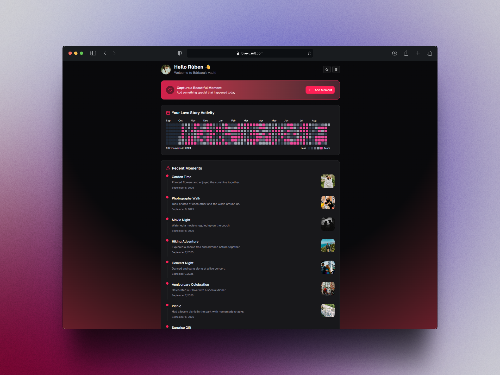
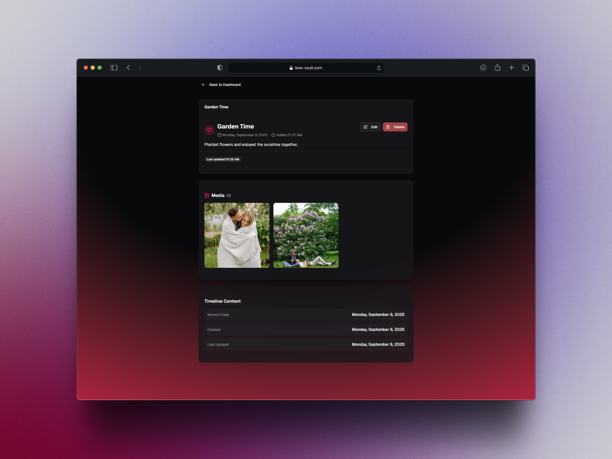
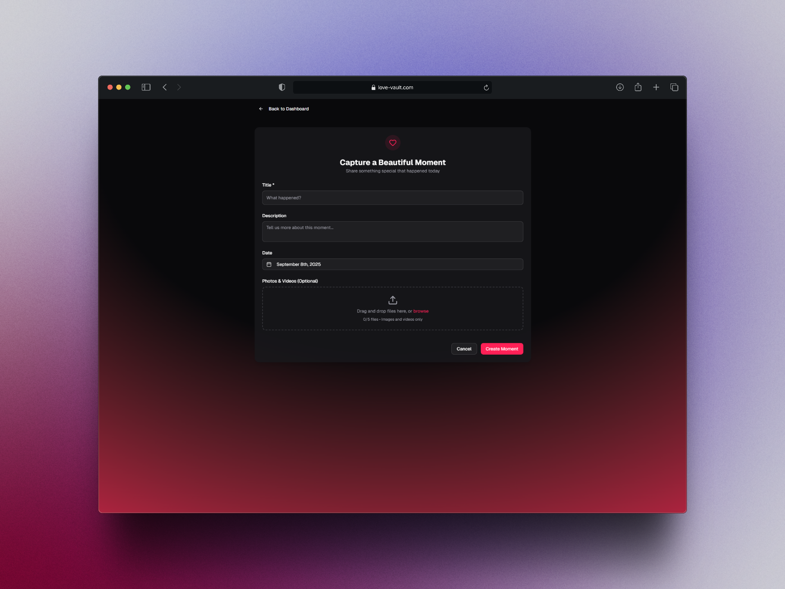

# 💖 Love Vault

A modern web app to store and celebrate your special memories.
Built with [Next.js](https://nextjs.org/), [Tailwind CSS](https://tailwindcss.com/), and deployed on [Vercel](https://vercel.com/).

---

## ✨ Demo

🔗 **Live Demo**: [love-vault.vercel.app](https://love-vault.vercel.app)

📸 **Screenshots**





---

## 🚀 Features

-   🗂️ Create and manage your personal memory vaults
-   🖼️ Add photos, notes, and special dates
-   🎨 Clean, modern, and intuitive design
-   ⚡ Fast & optimized (Next.js + Vercel)

---

## 🛠️ Tech Stack

-   **Framework**: Next.js (App Router) + TypeScript
-   **Styling**: Tailwind CSS, shadcn/ui
-   **Animations**: Framer Motion
-   **Validation**: Zod
-   **Database**: Supabase
-   **Hosting**: Vercel
-   **Analytics**: Vercel Analytics

---

## 📦 Installation

Clone and set up locally:

```bash
# Clone repo
git clone https://github.com/the-rfer/love-vault.git
cd love-vault

# Install dependencies
npm install

# Start dev server
npm run dev
```

Your app will be live at [http://localhost:3000](http://localhost:3000).

---

## 🔑 Environment Variables

Create a `.env.local` file in the project root and add:

```bash
NEXT_PUBLIC_SUPABASE_URL=your_supabase_project_url
NEXT_PUBLIC_SUPABASE_ANON_KEY=your_supabase_anon_key
NEXT_PUBLIC_SITE_URL=http://localhost:3000
```

---

## 🚀 Deployment

Deploy with one click on **Vercel**:

[](https://vercel.com/import/project?template=https://github.com/your-username/love-vault)

---

## 📊 Analytics

-   **Vercel Analytics**: enable in the Vercel dashboard.

---

## 🗂️ Project Structure

```
love-vault/
├── app/                # Next.js app router pages
├── components/         # Reusable UI components
├── actions/            # Server actions
├── lib/                # Utilities & helpers
├── scripts/            # Executable SQL scripts for Supabase
├── public/             # Static assets
└── ...
```

---

## 🤝 Contributing

Contributions are welcome! Please open an issue or submit a pull request.

---

## 📜 License

MIT License © [Rúben Fernandes](https://github.com/the-rfer)
